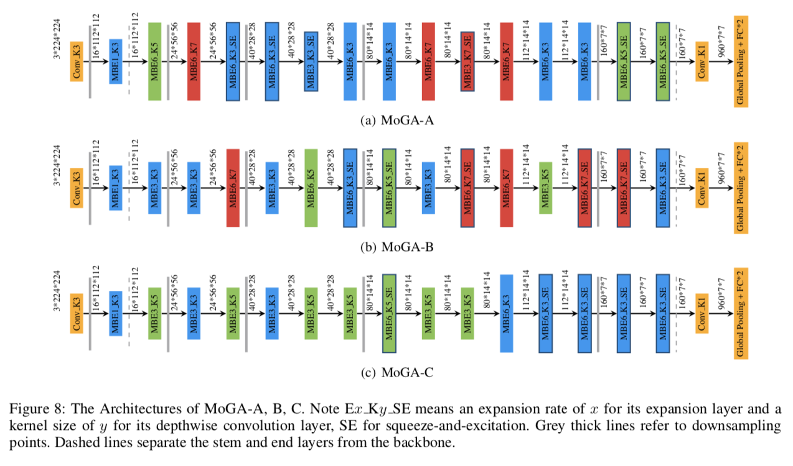
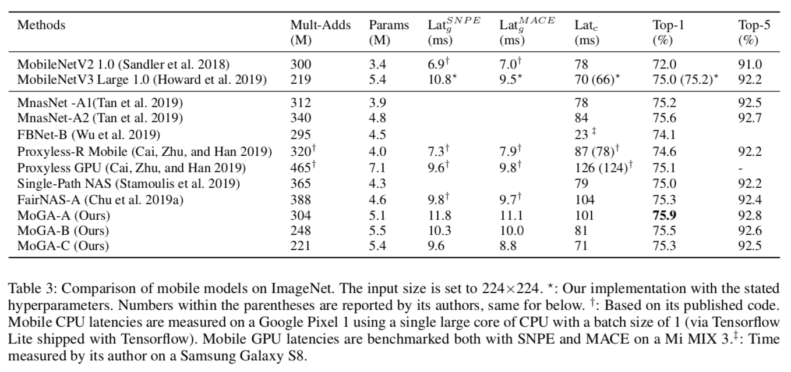

# MoGA: Searching Beyond MobileNetV3

We propose the first Mobile GPU-Aware (MoGA) neural architecture search in order to be precisely tailored for real-world applications. Further, the ultimate objective to devise a mobile network lies in achieving better performance by maximizing the utilization of bounded resources. While urging higher capability and restraining time consumption, we unconventionally encourage increasing the number of parameters for higher representational power. Undoubtedly, these three forces are not reconcilable and we have to alleviate the tension by weighted evolution techniques. Lastly, we deliver our searched networks at a mobile scale that outperform MobileNetV3 under the similar latency constraints, i.e., MoGA-A achieves 75.9% top-1 accuracy on ImageNet, MoGA-B meets 75.5% which costs only 0.5ms more on mobile GPU than MobileNetV3, which scores 75.2%. MoGA-C best attests GPU-awareness by reaching 75.3% and being slower on CPU but faster on GPU.

## MoGA Architectures

## Requirements
* Python 3.6 +
* Pytorch 1.0.1 +
* The pretrained models are accessible after submitting a questionnaire: https://forms.gle/o2cUfQPieVcm3t8B8.
* 国内用户填写问卷 https://wj.qq.com/s2/4185162/97a0 后就可以下载预训练模型。

## Benchmarks on ImageNet

## ImageNet Dataset

We use the standard ImageNet 2012 dataset, the only difference is that we reorganized the validation set by their classes. 

## Evaluation

To evaluate,

    python3 verify.py --model [MoGA_A|MoGA_B|MoGA_C] --device [cuda|cpu] --val-dataset-root [path/to/ILSVRC2012] --pretrained-path [path/to/pretrained_model]

## Citation

This repository goes with this paper, your citations are welcomed!

    @article{chu2019moga,
        title={MoGA: Searching Beyond MobileNetV3},
        author={Chu, Xiangxiang and Zhang, Bo and Xu, Ruijun},
        journal={ICASSP},
        url={https://arxiv.org/pdf/1908.01314.pdf},
        year={2020}
    }
